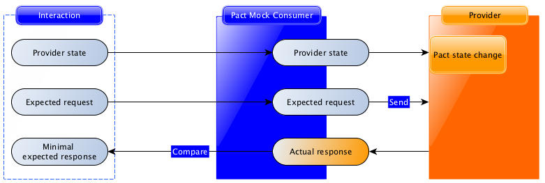

# Contract Testing with Pact

## Overview

Contract testing is a crucial validation technique that ensures consistent and reliable communication between microservices or components within an application. It involves creating contracts, typically in the form of Pact files, that define the expected interactions between the consumer and provider applications.

## Consumer Application Flow

1. **Define Contracts**: The consumer application outlines the anticipated interactions with the provider application using Pact contracts. These contracts precisely describe expected requests, responses, and any specific conditions.

2. **Generate Pact Contracts**: Using the defined expectations, the consumer application generates Pact contract files. These files capture the required requests and their corresponding expected responses.

3. **Verify with Mock Service**: During testing, the consumer application employs the generated Pact contracts to validate its interactions against a mock service. This confirms that the consumer sends requests and receives responses in line with the contract.

## Provider Application Flow

1. **Implement Contracts**: The provider application utilizes the Pact contracts provided by the consumer to implement matching endpoints. This guarantees that the provider's behavior aligns with the expected interactions.

2. **Perform Pact Verification**: The provider application conducts pact verification, comparing its actual responses against the expected responses outlined in the contracts.

3. **Communication of Verification Results**: The results of the verification are communicated back to the consumer. A successful verification indicates compatibility and alignment between the consumer and provider.

## Benefits of Contract Testing

- **Early Issue Detection**: Integration problems are identified early in the development cycle.
- **Precise Communication**: Expectations are explicitly communicated between teams.
- **Quick Feedback Loop**: Rapid feedback during development and testing.
- **Enhanced Collaboration**: Consumer and provider teams collaborate seamlessly.

## Getting Started

1. Define your Pact contracts in the consumer application.
2. Generate Pact contract files based on these contracts.
3. Test consumer interactions using the mock service.
4. Implement corresponding endpoints in the provider application.
5. Perform pact verification to ensure compatibility.
6. Collaborate with consumer teams based on verification results.

## Further Resources

- Learn more about [Pact](https://docs.pact.io/).
- Explore [Contract Testing](https://martinfowler.com/bliki/ContractTest.html) concepts by Martin Fowler.

---

### Contract Testing: A Better Approach for Service Interactions

When it comes to testing the interactions between your services, contract testing stands out as a more efficient and reliable choice compared to other testing approaches.

#### Unit Testing:

- Focuses on testing individual code units.
- Might miss integration issues between components.
- Doesn't ensure compatibility with external services.
- Limited coverage for service interactions.

#### Integration Testing:

- Involves testing interactions between multiple components.
- Complex to set up and maintain.
- May not cover all external service interactions.
- Not dedicated solely to API interactions.

#### End-to-End (E2E) Testing:

- Tests the entire application flow.
- Involves real environments and setups.
- Can be slow, brittle, and costly.
- Doesn't provide isolation for API contract testing.

#### **Contract Testing Advantages**:

- **Isolation**: Focuses on API interactions, simplifying issue detection.
- **Speed**: Provides faster feedback compared to E2E testing.
- **Accuracy**: Aligns code with expected external service behavior.
- **Early Detection**: Catches issues before they reach higher-level tests.
- **Collaboration**: Facilitates collaboration between teams managing services.
- **Reduced Dependencies**: Minimizes reliance on external services during development.
- **Stability**: Prevents changes in one service from breaking others.
---